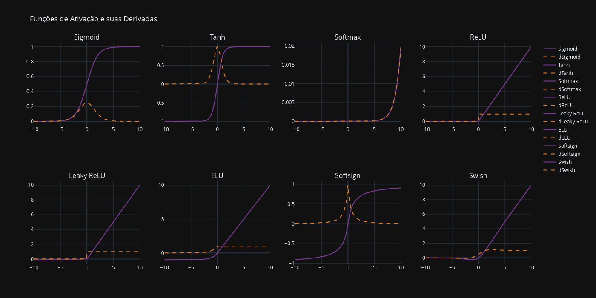

# 🚀 Funções de Ativação em Redes Neurais

## 📌 Introdução

As **funções de ativação** são componentes essenciais das redes neurais 🧠, pois introduzem **não linearidade** ao modelo, permitindo que a rede aprenda relações complexas entre as entradas e saídas.  

Sem essas funções, uma rede neural profunda seria **equivalente a uma simples combinação linear** de suas camadas, tornando-a incapaz de resolver problemas mais complexos.  

📖 **Neste repositório, exploramos diversas funções de ativação**, abordando suas **representações matemáticas, aplicações, vantagens e desvantagens**.

---

## 📖 Teoria: Detalhamento das Funções de Ativação

Aqui estão as principais funções de ativação utilizadas em redes neurais, explicadas em detalhes:

### 1️⃣ Sigmoid (Logistic Function) 📈

- **Fórmula:**  
  $$\sigma(x) = \frac{1}{1 + e^{-x}}$$
- **Derivada:**  
  $$\sigma'(x) = \sigma(x) \cdot (1 - \sigma(x))$$
- **Forma:** Curva em "S" (sigmoide).
- **Aplicações:**  
  ✅ Modelagem probabilística  
  ✅ Classificação binária  
- **Problema:** Sofre com **gradiente desaparecendo**, dificultando o aprendizado em redes profundas.

---

### 2️⃣ Tanh (Tangente Hiperbólica) 🔄

- **Fórmula:**  
  $$tanh(x) = \frac{e^x - e^{-x}}{e^x + e^{-x}}$$
- **Derivada:**  
  $$tanh'(x) = 1 - tanh^2(x)$$
- **Forma:** Curva em "S", semelhante à Sigmoid.
- **Aplicações:**  
  ✅ Melhor desempenho que Sigmoid em **camadas ocultas**, pois é centrada em zero.  
- **Problema:** Ainda sofre de **gradiente desaparecendo**, mas menos que Sigmoid.

---

### 3️⃣ Softmax 🏆

- **Fórmula:**  
  $$S(x_i) = \frac{e^{x_i}}{\sum_{j} e^{x_j}}$$
- **Forma:** Função vetorial que converte múltiplas saídas em probabilidades.
- **Aplicações:**  
  ✅ Usada na **camada de saída** para **classificação multiclasse**.  
- **Problema:** Pode ser **sensível a valores extremos**, então recomenda-se normalização.

---

### 4️⃣ ReLU ⚡ (Rectified Linear Unit)

- **Fórmula:**  
  $$ReLU(x) = \max(0, x)$$
- **Derivada:**  
  $$ReLU'(x) = \begin{cases}

1, & x > 0 \\
0, & x \leq 0
\end{cases}$$

- **Forma:** Linear para valores positivos.
- **Aplicações:**  
  ✅ Função mais utilizada em **redes profundas**.  
- **Problema:** Neurônios mortos (quando \( x < 0 \), a saída é 0 para sempre).

---

### 5️⃣ Leaky ReLU 💡

- **Fórmula:**  
  $$LeakyReLU(x) = \begin{cases}

x, & x > 0 \\
\alpha x, & x \leq 0
\end{cases}$$

- **Aplicações:**  
  ✅ Soluciona o problema de **neurônios mortos** da ReLU.

---

### 6️⃣ ELU 🚀 (Exponential Linear Unit)

- **Fórmula:**  
  $$ELU(x) = \begin{cases}

x, & x > 0 \\
\alpha (e^x - 1), & x \leq 0
\end{cases}$$

- **Aplicações:**  
  ✅ Propaga melhor o gradiente do que ReLU.

---

### 7️⃣ Softsign 🔄

- **Fórmula:**  
  $$Softsign(x) = \frac{x}{1 + |x|}$$
- **Aplicações:**  
  ✅ Alternativa à Tanh.

---

### 8️⃣ Swish 🌟

- **Fórmula:**  
  $$Swish(x) = x \cdot \sigma(x)$$
- **Aplicações:**  
  ✅ Melhor desempenho em redes modernas como **EfficientNet**.

---

## 📊 Gráficos das Funções e Suas Derivadas

🔹 **Função de ativação** → **Violeta** 🟣  
🔸 **Derivada** → **Laranja** 🟠  

## 📜 Conclusão

🎯 As **funções de ativação** desempenham um papel **crucial** no aprendizado profundo.  
🔍 Cada função tem suas vantagens e desvantagens, e **a escolha certa pode impactar diretamente a performance da rede**.

✅ **Funções como ReLU, ELU e Swish** são as mais eficientes para redes neurais profundas.  
❌ **Sigmoid e Tanh** são mais usadas para camadas ocultas menores.  
🔢 **Softmax** é ideal para **classificação multiclasse**.

> ⚠️ **Nota sobre a Derivada da Softmax**  
>
> A **Softmax** é uma **função vetorial**, cuja derivada é uma **matriz Jacobiana** 🧮,  
> impossibilitando uma representação gráfica direta.  
>
> 📌 **Solução:**  
> Para visualização, usamos a **derivada parcial de um único neurônio** em relação à sua própria entrada:  
>
> $$
> \frac{dSoftmax(x_i)}{dx_i} = Softmax(x_i) \cdot (1 - Softmax(x_i))
> $$
>
> 🔹 Esse termo corresponde à derivada da **Sigmoid**, mas aplicada individualmente a cada saída da Softmax.

